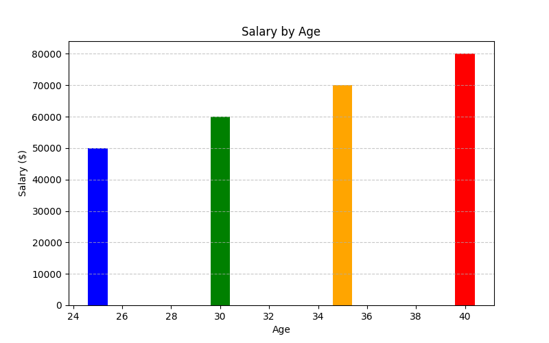

# Python Libraries for AI/ML

## 📌 Overview  
This section explores essential Python libraries for AI/ML development. It covers NumPy for numerical operations, Pandas for data wrangling, and Scikit-Learn for machine learning model training and evaluation.

## ✅ Topics Covered  
✔ NumPy – Working with arrays, mathematical computations, and statistical analysis.  
✔ Pandas – Data manipulation, filtering, grouping, and visualization.  
✔ Scikit-Learn – Training ML models, performance evaluation, and generating reports.  

---

## 📂 Folder Contents  
| File                     | Description |
|--------------------------|-------------|
| `numpy_basics.py`        | Demonstrates NumPy operations for AI/ML workflows. |
| `pandas_data_wrangling.py` | Covers Pandas for data preprocessing and visualization. |
| `sklearn_intro.py`       | Introduces Scikit-learn for training and evaluating ML models. |
| `numpy_processed_data.csv` | Processed NumPy dataset with computed values. |
| `pandas_visualization.png` | Bar chart visualization of salary vs. age. |
| `model_report.html`       | HTML report containing model evaluation metrics. |

---

## 📌 Output & Features  

### 1️⃣ NumPy (`numpy_basics.py`)  
✔ Created and manipulated 1D and 2D NumPy arrays.  
✔ Performed element-wise mathematical operations.  
✔ Computed key statistics (mean, standard deviation, min, max).  
✔ Reshaped arrays and generated a random matrix.  
✔ Stored processed data in `numpy_processed_data.csv`:  

📂 Saved File: `numpy_processed_data.csv`  

| Original Array | Squared | Doubled |
|---------------|---------|---------|
| 2            | 4       | 4       |
| 4            | 16      | 8       |
| 6            | 36      | 12      |
| 8            | 64      | 16      |
| 10           | 100     | 20      |

---

### 2️⃣ Pandas (`pandas_data_wrangling.py`)  
✔ Created a structured Pandas DataFrame with salary and age data.  
✔ Performed data filtering, grouping, and column transformations.  
✔ Generated a bar chart visualization for salary vs. age.  

📂 Saved File: `pandas_visualization.png`  

📌 Visualization:  

  

---

### 3️⃣ Scikit-Learn (`sklearn_intro.py`)  
✔ Created sample data for binary classification.  
✔ Trained a Logistic Regression model.  
✔ Evaluated model performance using:  
   - Accuracy Score  
   - Confusion Matrix  
   - Classification Report  
✔ Generated an interactive HTML report for results.  

📂 Saved File: `model_report.html`  

📌 Model Performance Report (from HTML file):  
- Model: Logistic Regression  
- Accuracy: 100% (1.00)  
- Confusion Matrix:  
  ```
  Actual 0  | Predicted 0: 1 | Predicted 1: 0
  Actual 1  | Predicted 0: 0 | Predicted 1: 2
  ```
- Classification Report:  
  ```
              precision    recall  f1-score   support
           0       1.00      1.00      1.00         1
           1       1.00      1.00      1.00         2
    accuracy                           1.00         3
   macro avg       1.00      1.00      1.00         3
weighted avg       1.00      1.00      1.00         3
  ```

📌 HTML Report Includes:  
- Model Accuracy  
- Confusion Matrix  
- Classification Report  
- Fully formatted for web viewing.  

---

## 🛠 Final Updates & Fixes  
✔ Removed unnecessary print prompts for cleaner execution.  
✔ Verified all scripts output structured, useful data (CSV, PNG, HTML).  
✔ Ensured correct formatting of stored files.  
✅ All scripts fully tested and working perfectly!  

---

## 📌 Next Steps  
🚀 Move on to `4_Unsupervised_Learning/`  
🎯 Explore clustering and dimensionality reduction techniques in AI/ML.  

